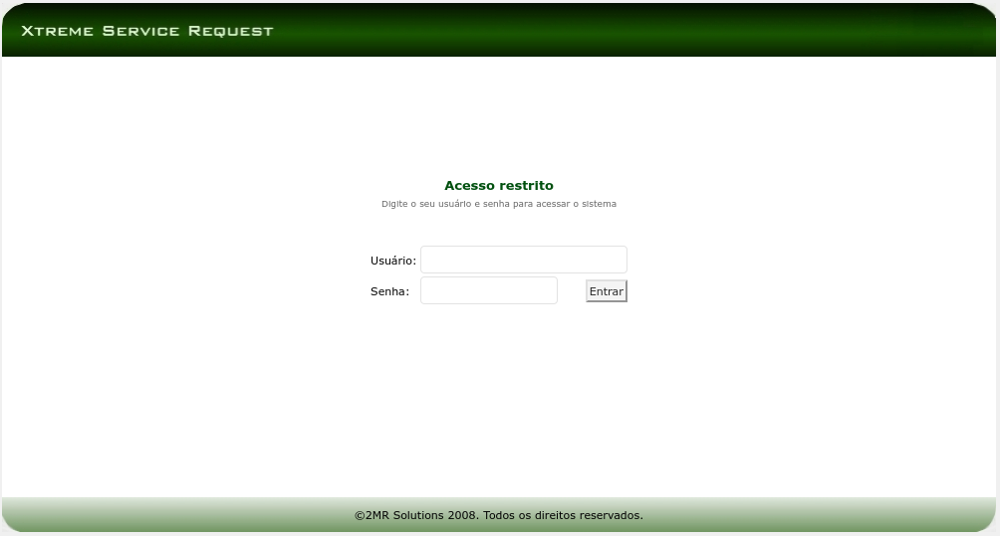

= Final project for Analysis and System Development at UMC

== Overview
Monolithic application for mitigating technical support issues accordingly to ITIL best practices

== Stack
- Java EE with JSP + Servlets
- PostgreSQL DB

== Requisites
- JDK8 or higher
- Maven
- Docker

== How to test locally

=== Build the executable
In your favorite terminal, at the project root folder execute the command below to build and generate the war package:
[source, bash]
--
mvn clean package
--

=== Start the database
Still at the project root folder, run the following to download the database image and start it via Docker:
[source, bash]
--
docker-compose -f docker/docker-compose-postgres up
--

=== Database initial setup
The first time you start Postgresql DB, only the schema is created automatically, so that it's required to create tables and indexes, as well as populate them with initial data for the application to work as desired in the next steps.

==== DB Connection
Connect to the database with the following credentials on a SQL client of choice, for instance DBeaver or Squirrel, or even via command line.

* Host: localhost
* Port: 5432
* User: postgres
* Password: aula
* Database: xsr

==== DB Scripts
Load the script located at `help/scripts.sql` to generate tables and another necessary resources.

=== Start the application server
Now it's time to start Tomcat to deploy the war generated at the _build_ step.
[source, bash]
--
docker-compose -f docker/docker-compose-tomcat up
--

=== Validate the application
In your favorite browser verify that you can access the application at http://localhost:9090/xsr-v1.

Expected result:

